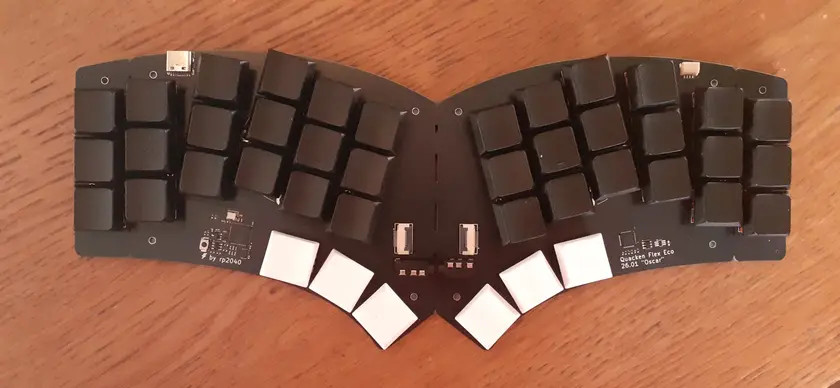

# Quacken

Libre, ergonomic, *polymorphic*: a single PCB for many possible layouts.

[3×6, 3×5, hummingbird, and everything in between](https://html-preview.github.io/?url=https%3A%2F%2Fgithub.com%2FNuclear-Squid%2FQuacken%2Fblob%2Fmain%2Findex.html).

## Roadmap

- [x] **Quacken Zero**: unibody
  - [x] first batch with a Pro Micro slot, to experiment geometry and design choices
  - [ ] next batches with an onboard nRF52840 (Bluetooth LE) and the updated geometry

- [x] **Quacken Flex**: unibody by default, splittable by choice
  - [x] onboard RP2040 (left) and I/O expander (right)
  - [x] splittable in two (I²C communication over a TRRS cable)
  - [x] splittable outer columns
  - [ ] hotswap sockets
  - [ ] optional Circle Trackpad
  - [x] optional rotary encoders

- [ ] **Marie-Quackenette**: split and wireless variant of the Quacken Flex.

## Note to time travelers

This revision of the board isn’t the one presented in the screenshots above.
The keyboard is only functional as a unibody only, not when split.
